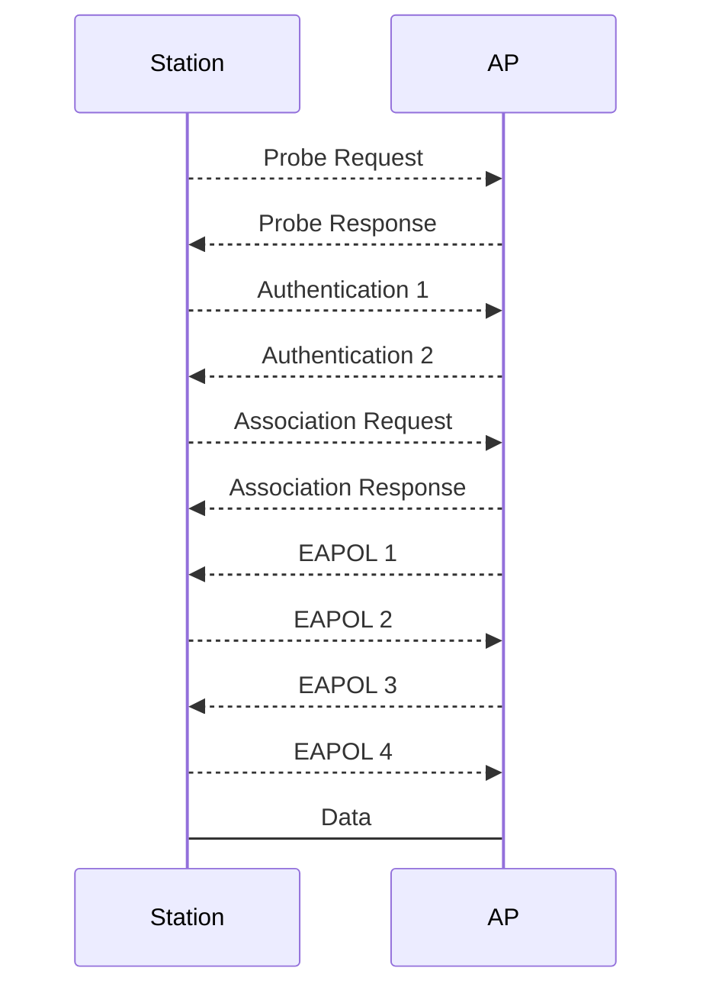

Station이 AP에 접속하는 과정은 다음과 같다.


* Station은 주기적으로 "이러한 AP가 있어요?"라고 broadcast로 SSID를 포함하여 질의한다(Probe Request). 이는 Station이 AP에 접속되어 있는 경우에도 주기적으로 발생한다(신호 세기가 더 높은 AP에 접속하기 위해서).
* AP은 Station이 보내는 Probe Request 패킷에 자신의 SSID가 포함되어 있는 경우 응답을 해야 한다(Probe Response).
* AP가 Open mode일 때에는 EAPOL 패킷이 발생하지 않는다.

<br>
연결을 끊을 때에는 Deauthentication(줄여서 Deauth) 혹은 Disassociation packet이 발생하며 다음과 같은 종류가 있다. Attacker는 이러한 Deauth 패킷을 발생시켜 기존의 연결을 강제적으로 끊을 수 있으며 이를 Deauth Attack이라 한다.

|Name|Direction|Description|
|-|-|-|
|AP broadcast|AP -> Broadcast|AP가 모든 Station에게 연결을 끊으라고 할 때|
|AP unicast|AP -> Station|AP가 특정 Station에게 연결을 끊으라고 할 때|
|Station unicast|Station -> AP|특정 Station이 AP에게 연결을 끊겠다라고 할 때|

Deauth Attack은 aireplay-ng 명령어를 통해서 실습할 수 있다.
```
syntax : sudo aireplay-ng <interface> --deauth <count> -a <bssid>
example : sudo aireplay-ng mon0 --deauth 10 -a 11:22:33:44:55:66
```

<br><br>
특정 Station에 AP에 연결이 되어 있는 상태에서 해당 Station과 똑같은 Mac address값을 가지고 동일한 AP에 연결을 시도하면(Attacker는 Authentication 1 및 Association Request 패킷을 전송) 기존 Station의 연결이 끊기게 된다. 이를 Authenticaton Attack(줄여서 Auth Attack)이라 한다. WPA3 표준에서는 이러한 Deauth Attack, Auth Attack은 방어하는 기능이 탑재되어 있다.

## Youtube
https://youtu.be/2bwT-GSt-9A