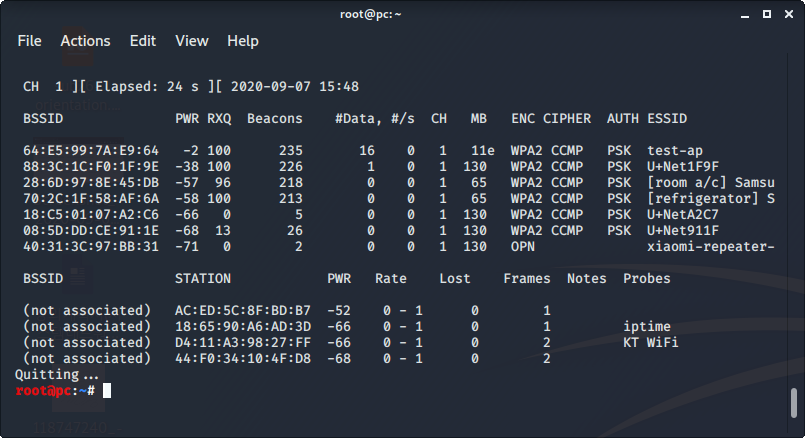

Dot11 Frame
===

802.11(Dot11) Frame은 크게 3가지의 종류로 나뉜다.  
 
* Management Frames
  * Association request
  * Association response
  * Reassociation request
  * Reassociation response
  * Probe request
  * Probe response
  * Beacon
  * ATIM
  * Disassociation
  * Authentication
  * Deauthentication
  * Action
 
* Control Frames
  * Block ACK request
  * Block ACK
  * PS-Poll
  * Ready To Send
  * Clear To Send
  * ACK
  * CF-End
  * CF-End/CF-Ack
 
* Data Frames
  * Data
  * Data+CF-Ack
  * Data+CF-Poll
  * Data+CF-Ack+CF-Poll
  * Null
  * CF-Ack
  * CF-Poll
  * CF-Ack+CF-Poll
  * QoS Data
  * QoS Data+CF-Ack
  * QoS Data+CF-Poll
  * QoS Data+CF-Ack+CF-Poll
  * QoS Null
  * QoS CF-Poll
  * QoS CF-Ack+CF-Poll

airodump-ng을 통하여 beacon, probe request, probe response, data frame을 확인할 수 있다.  

[Wireshark Most Common 802.11 Filters v1.1](wireshark_802.11_filters_-_reference_sheet.pdf)  
출처 : https://www.semfionetworks.com/uploads/2/9/8/3/29831147/wireshark_802.11_filters_-_reference_sheet.pdf
