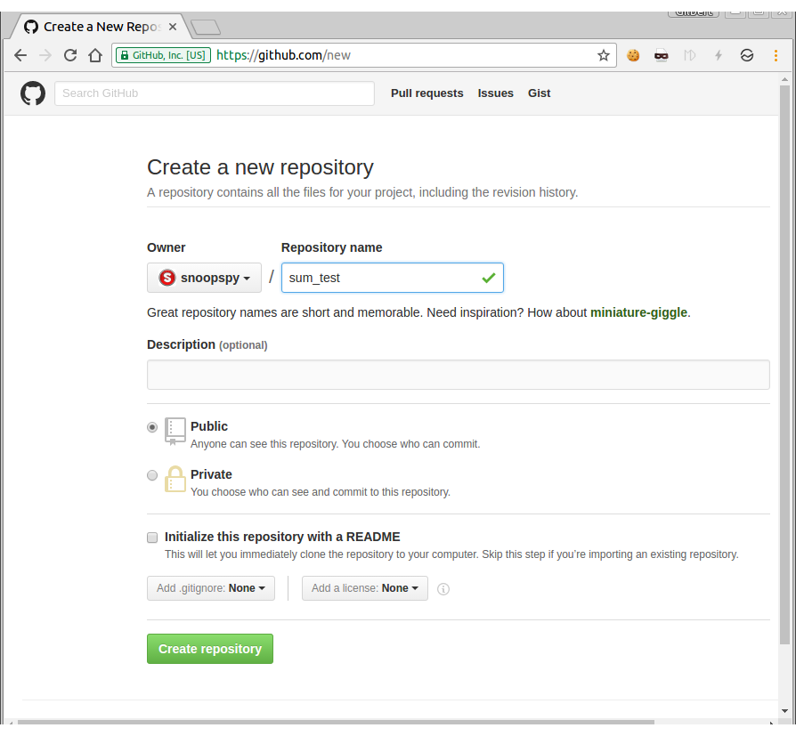

Git Example
===

요즘 대부분의 IT 업체에서는 git나 svn을 source code 관리 형상 툴로 사용을 합니다. 그런데 아직 이러한 툴의 사용을 잘 모르는 경우가 많습니다. git는 한번 익혀 두면 사용되어질 곳이 많이 있으니 반드시 익혀 두시기 바랍니다.  

과제를 낼 때에는 따로 zip 파일을 첨부해서 내지 말고 자신의 소스 코드를 특정 git repository(예: github.com)에 올린 다음 그 git repository 주소를 과제로 내면 됩니다.

본 문서에서는 다음과 같은 간단한 예제를 통하여 git를 익혀 보도록 하겠습니다.


## git 설치 및 환경 설정

apt로 git를 설치합니다.
```
$ sudo apt install git
```

user name을 등록합니다.

```
$ git config --global user.name <사용자명>

ex : $ git config --global user.name gilgil
```

email을 등록합니다.
```
$ git config --global user.email <이메일주소>

ex : $ git config --global user.email gilgil@gilgil.net
```

git push를 할 때마다 id, password을 물어 보는 경우가 있는데 cache를 두어 여러번 입력하지 않아도 될 수 있도록 합니다.
```
$ git config --global credential.helper "cache --timeout=360000"
```

git server와의 통신에서  SSL verify를 끄고 싶은 경우 다음과 같아 합니다.
```
$ git config --global http.sslverify "false"
```

git 환경 설정은 다음과 같은 명령어로 확인할 수 있습니다.

```
$ git config --global --list
```

## SSH Key 

github 및 gitlab 사이트는 ID/PW 기반의 Authentication을 금지하고 Token Authentication이라는 것을 도입하였습니다. 자신의 리눅스 OS에서 SSH key를 생성해서 Token Authentication 설정을 해줘야 합니다. 우선 다음과 같은 명령어로 SSH key를 생성합니다.  

```
ssh-keygen -t rsa -b 4096 -C "your_email@example.com"
혹은
ssh-keygen -t ed25519 -C "your_email@example.com"
```

~/.ssh directory에 private key 및 public key가 생성되었는지 확인합니다.  

```
ls -l ~/.ssh
```

public key를 "cat" 명령어로 확인한 이후 [github](https://github.com/settings/keys) 혹은 [gitlab](https://gitlab.com/-/profile/keys) 설정 화면에서 public key를 해당 웹사이트에 등록해 줍니다.  

## github.com 계정 생성 및 repository 생성

github.com 사이트에 들어 가서 자신의 계정을 생성합니다.

"sum-test"라는 repository를 생성합니다.  

  

git clone 명령어를 이용하여 repository를 가져 옵니다.
```
$ git clone git@github.com:snoopspy/sum-test.git
```


## 소스 코드 작성

작성할 프로그램은 숫자 1부터 10까지의 합을 출력하는 프로그램입니다. 소스 파일은 다음과 같이 구성합니다.  

1. sum.h : sum이라는 함수를 선언(declaration)한다.  
2. sum.cpp : sum이라는 함수를 정의(definition)한다.  
3. main.cpp : sum(10)을 호출한다. sum이라는 함수는 sum.h에 선언되어 있다.  
4. Makefile : sum-test라는 executable file을 만들고 관리한다.  

sum.h, sum.cpp 코드를 만들고 git add 및 commit을 합니다.

```c++
// sum.h
#pragma once

int sum(int n);
```

```c++
// sum.cpp
#include "sum.h"

int sum(int n) {
	int res = 0;
	for (int i = 1; i <= n; ++i)
		res += i;
	return res;
}
```

```
$ git add sum.*
$ git commit -m "Add sum modules"
```

main.cpp 코드를 만들고 git add 및 commit을 합니다.

```c++
// main.cpp
#include <stdio.h>
#include "sum.h"

int main() {
	int s = sum(10);
	printf("result=%d\n", s);
}
```

```
$ git add main.cpp
$ git commit -m "Add main.cpp"
```

Makfile을 만들고 git add 및 commit을 합니다.

```
#Makefile
all: sum-test

sum-test: sum.o main.o
	g++ -o sum-test sum.o main.o

main.o: sum.h main.cpp
	g++ -c -o sum.o sum.cpp

sum.o: sum.h sum.cpp
	g++ -c -o main.o main.cpp

clean:
	rm -f sum-test
	rm -f *.o
```

```
$ git add Makefile
$ git commit -m "Add Makefile"
```

make라는 명령어를 통하여 실행이 제대로 되는지 확인해 보고 git log로 제대로 남아 있는지 확인합니다.

다음과 같은 명령어로 remote repository에 push한 이후 제대로 push가 되었는지 확인합니다.
```
$ git push origin main
```

github.com 뿐만 아니라 git 서비스를 제공해 주는 다양한 사이트들이 있으며, 자체적인 git server를 구축할 수도 있습니다.

"git clone" 명령으로 git repository를 가져올 수도 있지만 "git init" 명령어로 git repository를 생성할 수도 있습니다.

```
$ mkdir sum-test
$ cd sum-test
$ git init
```

## References
[git - 간편 안내서](https://rogerdudler.github.io/git-guide/index.ko.html)  


## Youtube
https://youtu.be/gB-b9DGp8XU
