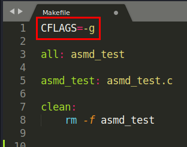
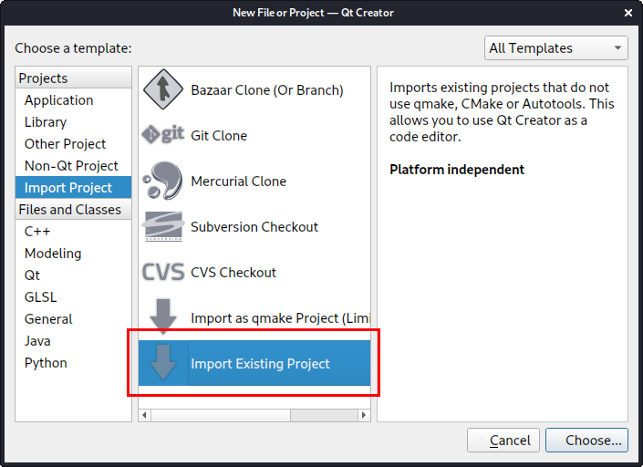
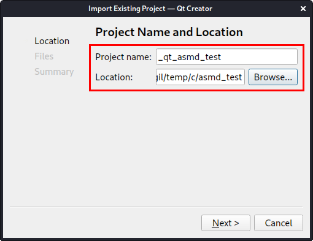
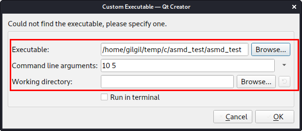
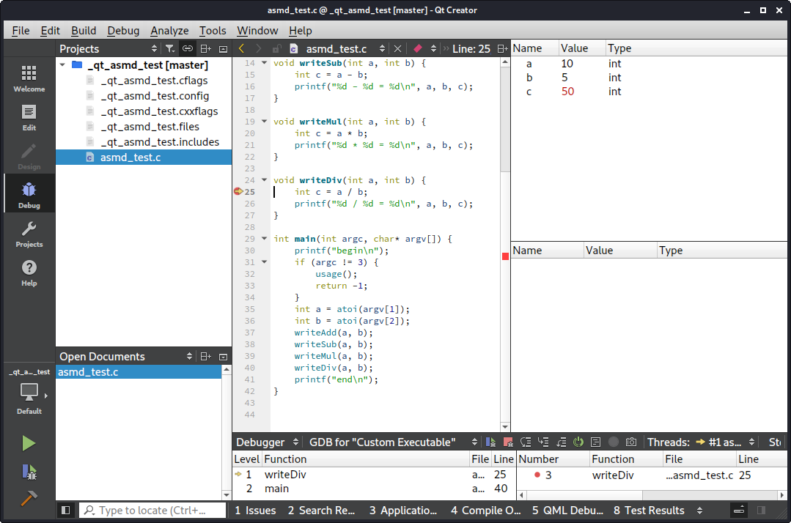

Import existing project in Qt
===

* 기존에 C/C++ 기반 프로젝트가 있을 때 Qt Creator에서 해당 프로젝트를 import하여 통합 개발 및 디버깅을 할 수 있다.

* Qt Creator에서 프로젝트를 import하기 위해서는 Makefile이 존재해야 한다.
그리고, Makefile에서 컴파일 옵션에 '-g' 옵션을 주어 향후 디버깅을 할 수 있게 설정하는 것이 좋다.  
  
[asmd_test.tar.gz](asmd_test.tar.gz)

* Qt Creator 메뉴에서 File > New File or Project > Import Project > Import Exising Project를 선택한다.  

* Location에는 기존 Makefile이 있는 폴더를 선택하고, Project Name에는 적당한 프로젝트 이름을 설정한다.
대략 프로젝트 이름 앞에 '\_qt\_'와 같은 적당한 prefix를 붙여 주는 것이 좋다.  

* 프로젝트가 생성되고 나서 Run(Ctrl+R)이나 디버깅을 시작할 때 실행파일을 명시해 준다.
필요에 따라 Command line arguments나 Working directory도 설정해 준다.  

* 이후 Qt Creator에서 편집, 실행, 디버깅 등이 가능하다.  

## Youtube
https://youtu.be/PKMXK5i7yWQ
