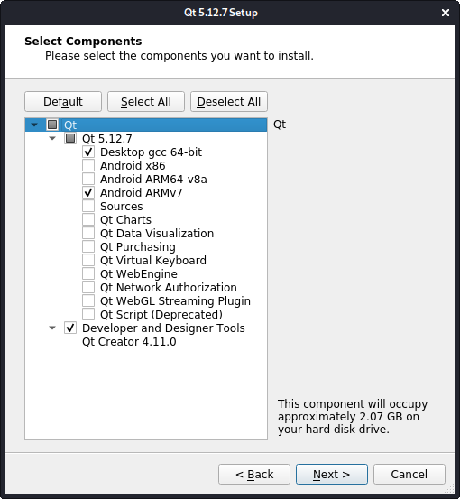

Qt install
==========

## Dependencies
* Qt는 통합개발환경(IDE)인 QtCreator와 Qt 관련 플랫폼(라이브러리)를 제공한다.
* Qt는 자체적으로 컴파일러를 내장하지 않고 있다. 따라서 다음과 같은 컴파일러를 미리 설치한 상태에서 Qt를 설치해야 한다.
```
Windows : msvc or mingw
Linux : gcc(g++) or clang(clang++)
```

## Select Installer
* 최신 버전을 설치하지 말고 LTS 버전을 설치한다.  
https://en.wikipedia.org/wiki/Qt_version_history

* Online Install  
https://qt.io > Download. Try. Buy > Go open source > Download the Qt Online Installer

* Offline Install  
https://download.qt.io > official_releases > qt 에서 OS에 맞는 파일을 다운받아 설치한다.  
chmod 명령을 주어 실행 권한을 준 다음 command line에서 설치한다.
```
chmod +x qt-opensource-linux-x64-5.12.7.run
./qt-opensource-linux-x64-5.12.7.run
```

## Select Components
모든 것을 다 설치할 필요가 없이 필요한 것들만 설치하면 된다.
* Desktop gcc 64-bit (PC앱 개발 - 필수)
* Android ARMv7 (안드로이드 앱 개발 - 옵션)
* Qt Creator (통합개발환경 - 필수)



## Sample(hello_world)
console application 실행이 안될 때 terminator를 설치해 준다.
```
sudo apt install terminator
```
gdb 설치를 해 주어야 디버깅이 가능하다.
```
sudo apt install gdb
```
## Sample(widget_test)
Qt에 서GUI 앱을 개발할 때에는 OpenGL 모듈을 사용하고 있기 때문에 OpenGL 관련 모듈을 미리 설치해 줘야 한다.
```
sudo apt install libglu1-mesa-dev
```

## Youtube
[https://youtu.be/v4w4Q0HtdOE](https://youtu.be/v4w4Q0HtdOE)
