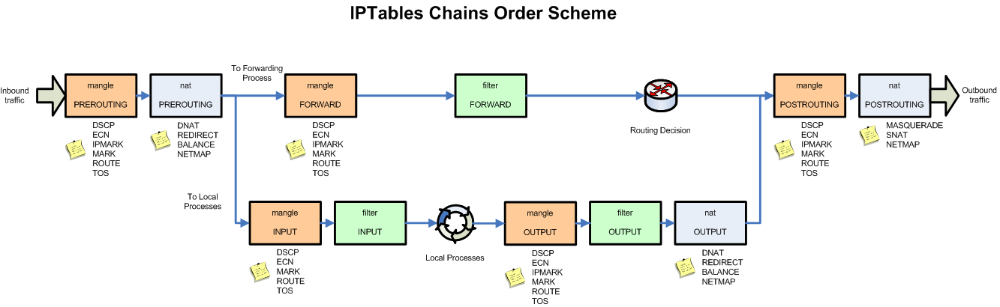

iptables의 구성도는 다음과 같습니다.  



외우기 어려우면 그냥 쉽게 INPUT, OUTPUT, FORWARD 정도만 익혀 두면 됩니다.

iptables의 help는 다음과 같습니다만, 다 외울 필요는 없습니다.

```
iptables v1.6.0

Usage: iptables -[ACD] chain rule-specification [options]
       iptables -I chain [rulenum] rule-specification [options]
       iptables -R chain rulenum rule-specification [options]
       iptables -D chain rulenum [options]
       iptables -[LS] [chain [rulenum]] [options]
       iptables -[FZ] [chain] [options]
       iptables -[NX] chain
       iptables -E old-chain-name new-chain-name
       iptables -P chain target [options]
       iptables -h (print this help information)

Commands:
Either long or short options are allowed.
  --append  -A chain		Append to chain
  --check   -C chain		Check for the existence of a rule
  --delete  -D chain		Delete matching rule from chain
  --delete  -D chain rulenum
				Delete rule rulenum (1 = first) from chain
  --insert  -I chain [rulenum]
				Insert in chain as rulenum (default 1=first)
  --replace -R chain rulenum
				Replace rule rulenum (1 = first) in chain
  --list    -L [chain [rulenum]]
				List the rules in a chain or all chains
  --list-rules -S [chain [rulenum]]
				Print the rules in a chain or all chains
  --flush   -F [chain]		Delete all rules in  chain or all chains
  --zero    -Z [chain [rulenum]]
				Zero counters in chain or all chains
  --new     -N chain		Create a new user-defined chain
  --delete-chain
            -X [chain]		Delete a user-defined chain
  --policy  -P chain target
				Change policy on chain to target
  --rename-chain
            -E old-chain new-chain
				Change chain name, (moving any references)
Options:
    --ipv4	-4		Nothing (line is ignored by ip6tables-restore)
    --ipv6	-6		Error (line is ignored by iptables-restore)
[!] --protocol	-p proto	protocol: by number or name, eg. `tcp'
[!] --source	-s address[/mask][...]
				source specification
[!] --destination -d address[/mask][...]
				destination specification
[!] --in-interface -i input name[+]
				network interface name ([+] for wildcard)
 --jump	-j target
				target for rule (may load target extension)
  --goto      -g chain
                              jump to chain with no return
  --match	-m match
				extended match (may load extension)
  --numeric	-n		numeric output of addresses and ports
[!] --out-interface -o output name[+]
				network interface name ([+] for wildcard)
  --table	-t table	table to manipulate (default: `filter')
  --verbose	-v		verbose mode
  --wait	-w [seconds]	wait for the xtables lock
  --line-numbers		print line numbers when listing
  --exact	-x		expand numbers (display exact values)
[!] --fragment	-f		match second or further fragments only
  --modprobe=<command>		try to insert modules using this command
  --set-counters PKTS BYTES	set the counter during insert/append
[!] --version	-V		print package version.

```

간단한 명령어를 통해서 익혀 보도록 하겠습니다.

chain안에 있는 모든 rule를 보여 준다.
```
sudo iptables -L
```

chain안에 있는 모든 rule를 삭제한다.
```
sudo iptables -F
```

cahin을 추가한다.
```
sudo iptables -A chain
```

cahin을 삭제한다.
```
sudo iptables -D chain
```

간단한 예제를 통해서 icmp를 차단해 보도록 하겠습니다. 설정 이후에 ping을 때려 보면 ping 통신이 되지 않는 것을 확인할 수 있습니다. Wireshark에서 icmp packet이 전혀 잡히지 않습니다.
```
sudo iptables -A OUTPUT -p icmp -j DROP
```

OUTPUT을 차단하지 않고 INPUT에서 차단을 설정합니다. 이 경우 ping 통신은 되지 않지만, Wireshark에서는 송수신되는 icmp packet이 모두 잡히게 됩니다.
```
sudo iptables -F
sudo iptables -A INPUT -p icmp -j DROP
```

TCP port 80을 제외한 나머지 TCP 트래픽은 차단하는 룰을 테스트해 봅니다.
```
sudo iptables -F
sudo iptables -A OUTPUT -p tcp --dport 80 -j ACCEPT
sudo iptables -A INPUT -p tcp --sport 80 -j ACCEPT
sudo iptables -A OUTPUT -p tcp -j DROP
sudo iptables -A INPUT -p tcp -j DROP

```

iptables의 사용법은 [구글링](https://www.google.com/search?q=iptables+%EC%98%88%EC%A0%9C)을 통해 익혀 두시기 바랍니다.
