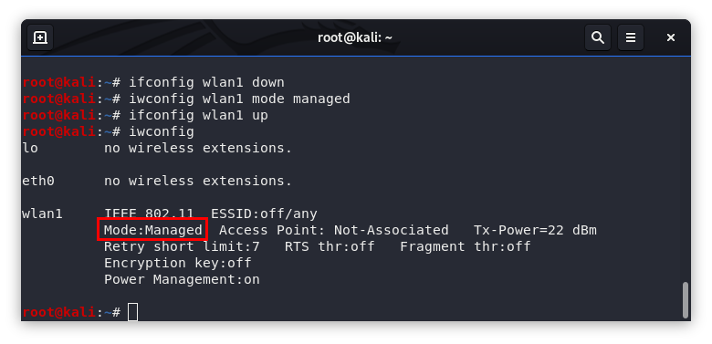
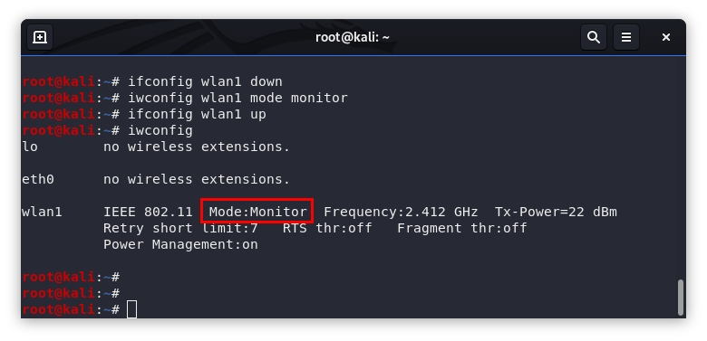
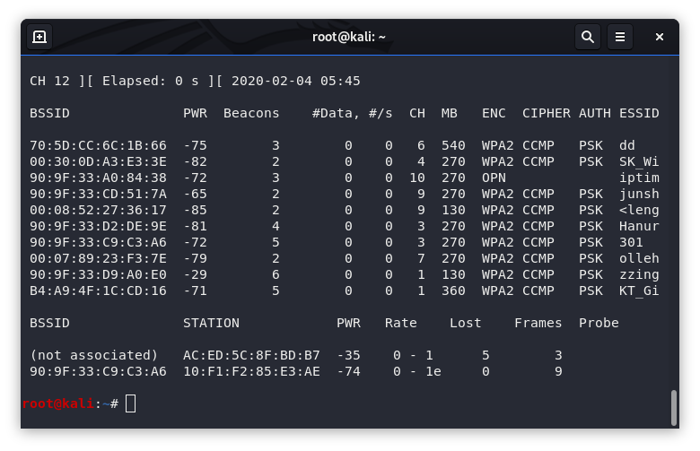

## wikipedia

https://en.wikipedia.org/wiki/Monitor_mode

## monitor mode를 지원하는 어댑터 구매

* 일부 노트북은 자체 내장 WiFi 칩셋이 monitor mode를 지원하는 경우도 있다(LG그램, Mac)
* [monitor mode chipset](https://www.google.com/search?q=monitor+mode+chipset), [best kali adapter](https://www.google.com/search?q=best+kali+adapter) 등으로 검색을 해서 USB Adapter를 구매한다.
* 해외 제품의 경우 배송에서부터 대략 3주 정도 소요되며, 같은 제품을 2개 이상 구매하는 경우 전파법에 위배되어 세관에 걸릴 수 있다.
* [TL-WN722N](https://www.google.com/search?q=TL-WN722N) 제품은 최신 제품이 monitor mode를 지원하지 않는다.
* ~~국내 제품의 경우~~ [~~iptime N150UA Solo~~](https://www.google.com/search?q=iptime+N150UA+Solo) ~~제품이 있는데, 2.4GHz 대역만 지원하며 패킷이 많이 잡히지 않는다는 단점이 있으나, 가격이 저렴하며 실습용으로는 무난하다. 그런데, 2020년 하반기부터 해당 제품 생산이 중단됨. ㅠㅠ~~
* 2022년 12월 현재 [iptime N150UA2](https://www.google.com/search?q=iptime+N150UA2) 제품이 발매가 되고 있으며 구매해서 테스트한 결과 802.11 packet sniffing 및 packet injection이 제대로 작동하는 것 확인하였다. 다만 2.4GHz 대역만 지원됨.
* 국내 제품의 경우 [ipTIME A2000UA-4dBi](https://www.google.com/search?q=ipTIME+A2000UA-4dBi) 제품은 5GHz까지 지원한다(외산에 비해서는 저렴하지만 가격이 흠좀무). [Install ipTIME A2000UA-4dBi driver in linux](https://gilgil.gitlab.io/2020/11/27/1.html) manual을 이용해서 linux에 설치가 가능하다.

## linux 설치

* windows에서는 잘 안된다. 해 보려고 발버둥(?) 치는 경우를 몇번 봤는데 결국은 linux로 회귀하더라.
* [ubuntu](https://www.ubuntu.com/download/desktop), [kali](https://www.kali.org/downloads/) 권장.

## 가상환경에서 linux 운영

* 우선 Host(예 : windows라) 해당 USB 디바이스가 네트워크 디바이스로 설치 및 인식이 제대로 되는지 확인한다. 설치가 제대로 되지 않는 경우 정당한 드라이버를 검색해서 설치한다.
* 가상 환경(vmware, virtualbox)에서 "Disconnect from Host"와 같은 명령어를 통해서 Image로 해당 USB 디바이스를 넣어 준다.
* 'ifconfig -a"와 같은 명령어를 통해서 해당 디바이드가 Image에서 인식이 되는지 확인한다.
* 가상 환경 - Settings - USB 옵션에서 USB 3.0으로 설정을 해 줘야 monitor mode packet이 많이 잡힌다. virtualbox의 경우 extension pack을 설치해 줘야 USB 3.0 옵션 설정이 가능하다.

## monitor mode로의 변환

* 해당 네트워크 Adapter interface를 다음과 같은 명령어로 monitor mode로 전환한다.

```
ifconfig <interface> down
iwconfig <interface> mode monitor
ifconfig <interface> up
```

\


* airmon-ng 명령어를 이용하여 monitor mode interface를 생성할 수도 있다.

```
airmon-ng start <interface>
```

## interface name의 변경

* 특정 interface에 대해서 이름을 변경할 수 있다.

```
ifconfig <old interface> down
ip link set <old interface> name <new interface>
ifconfig <new interface> up
```

## Network Manager의 처리

* Linux에서는 Network Manager라는 프로세스가 있고 이 프로세스는 설치되어 있는 모든 network device를 manage하게 된다. 이 경우 Network Manager가 monitor mode로 전환된 interface를 access하여 오동작을 일으켜 패킷을 잡는 도중에 오류가 날 수 있다. 이를 위해서 monitor mode로 사용되어 지는 interface를 Network Manager로 하여금 unmanage하도록 해야 한다. 2가지 방법이 있다.
  1. "/etc/NetworkManager/NetworkManager.conf" 파일 마지막에 다음과 같은 항목을 추가하여 Network-Manager로 하여금 특정 interface(이름이나 mac으로)에 대해서 manage를 하지 말도록 설정한다. 설정이 바뀐 이후에는 네트워크 서비스를 재시작( "sudo systemctl restart NetworkManager" )하거나 컴퓨터를 재부팅해야 한다.

  ```
  [keyfile]
  unmanaged-devices=interface-name:mon*;interface-name:wlan*mon;mac:00:11:22:33:44:55
  ```
  2. 해당 어댑터의 monitor mode 작동을 방해하는 프로세스가 떠 있을 경우 어댑터의 작동이 제대로 된 작동을 하지 못할 수 있다. 이 경우 다음과 같은 명령어를 통하여 해당 프로세스들을 죽이도록 한다(이 경우 NetworkManager와 같은 프로세스의 중지로 인해 정상적인 인터넷 사용이 되지 않을 수 있음).

  ```
  airmon-ng check kill
  ```

## 최종 확인

* 다음과 같은 명령을 통해서 802.11 packet이 제대로 잡히는지 확인한다. AP의 정보(화면 상단) 및 Station과 AP와의 통신 패킷(화면 하단)이 제대로 보이는지 확인한다.

```
airodump-ng <interface>
```



* 특정 AP의 channel을 알아낸 다음 해당 AP와 통신하는 Station간의 packet이 잡히는지 확인한다.

```
airodump-ng <interface> -c <channel>
```

* AP와 Station간의 packet이 제대로 잡히지 않는 경우 channel bandwidth를 이런 저런 값으로 변경하여 테스트해 본다.

```
iw [options] dev <interface> set channel <channel> [NOHT|HT20|HT40+|HT40-|5MHz|10MHz|80MHz]
```

## Youtube

* Monitor mode : https://youtu.be/GQqjdxwbEWE
* Monitor and managed mode conversion tools(gmon) : https://youtu.be/NsnGbZDrzpg
* Capturing 802 11 packets for Windows : https://youtu.be/acyRJEQNElM