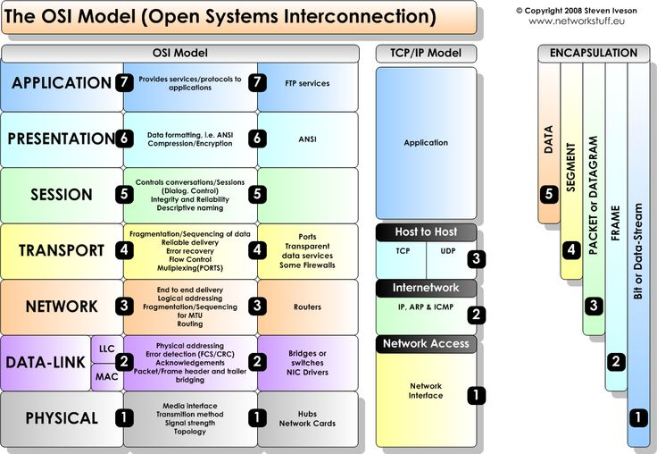
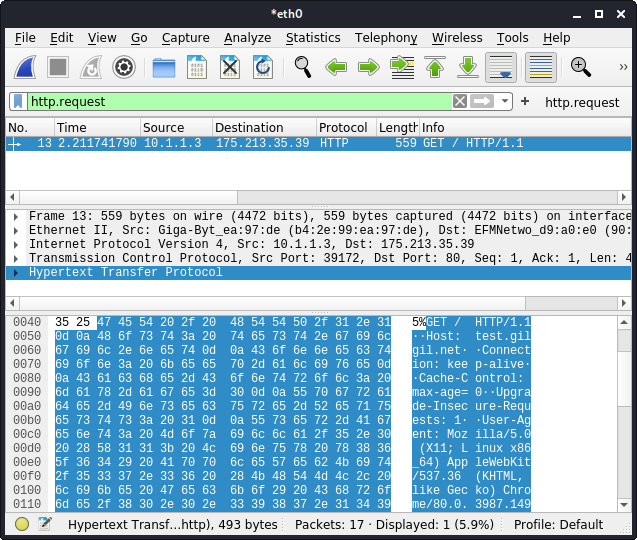

OSI model and TCP/IP Layer
===


네트워크 분야에서 제일 알아야 하는 것이 바로 OSI model과 TCP/IP layer이다.



OSI model은 다음과 같은 방식으로 암기하는 것이 좋다.

**_`P`lease `D`o `N`ot `T`ouch `S`teve's `P`et `A`lligator_**

참고 사항.

* Layer1(Physical Layer)는 Programming 영역에서 다루지 않는다.

* 현업에서는 Layer2(Data-Link), Layer3(Network), Layer4(Transport), Layer7(Application)의 구분만 한다.

* 특정 Protocol은 L2, L3, L4의 구분이 애매모호한 것들도 있다.

대표적인 Protocol은 다음과 같다.

* L2 : 가장 대표적인 protocol이 바로 Ethernet. 물론 다른 protocol도 많지만...

* L3 : 가장 대표적인 protocol이 바로 IP(IPv4). 물론 다른 protocol도 많지만...

* L4 : 가장 대표적인 protocol이 바로 TCP. 물론 다른 protocol도 많지만...

* L7 : 가장 대표적인 protocol이 바로 HTTP. 물론 다른 protocol도 많지만...

웹(HTTP) 통신이 이루어 지는 경우, (Ethernet 환경에서는) 아래와 같은 Protocol의 조합으로 통신이 이루어 지게 된다. 네트워크를 다루다 보면 많이 보게 되니까 아래 부분은 그냥 외우도록 한다.
```
ETH - IP - TCP - HTTP
```

Wireshark를 통하여 packet을 잡아 보고 실제로 ETH - IP - TCP - HTTP 의 조합으로 통신이 이루어 지는지 확인해 보도록 한다(display filter : "http.request").



"ETH((Ethernet II) - IP(Internet Protocl Version 4) - TCP(Transmission Control Protocol) - HTTP(Hypertext Transfer Protocol)"의 순서로 Packet이 구성되는 것을 확인할 수 있다.

워낙 많은 Protocol들이 존재하기 때문에 모든 것을 다 외울 필요는 없다. 필요한 것들 몇개 정도만 숙지를 하고 그 다음부터 새로운 Protocol을 익힐 때 어디에서 가지치기를 하는지 차근차근 알아 가면 된다.

[NETWORK ASSOCIATES GUIDE TO COMMUNICATIONS PROTOCOLS](protocols.pdf)
