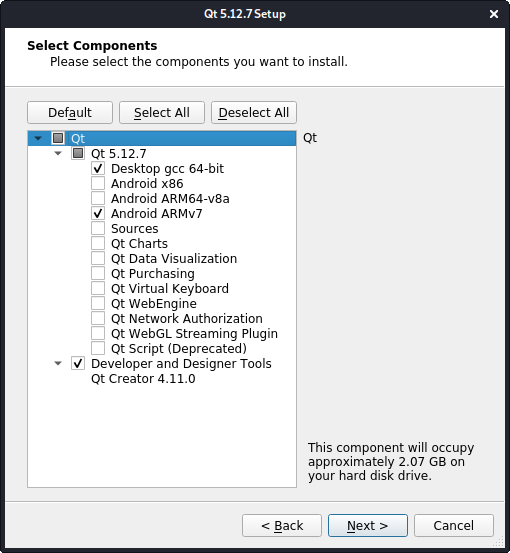

Setup Qt Android Development
===

Qt에서 Android 앱을 개발하는 데 필요한 setup 과정을 설명한다. 각각 설치 모듈에 대한 버전은 다음과 같다.

|Module|Version|
|---|---|
|OS|Kail 2020|
|Qt|5.12.7|
|JDK|openjdk-8-jdk|
|SDK|26.1.1|
|NDK|r21(21.0.6113669)|

## Qt 설치
* 최신 LTS 버전을 설치하도록 한다.

* 설치할 때 "Android ARMv7" component를 추가 설치한다.  


## JDK 설치

* http://openjdk.java.net 에 관련 설명이 있으니 참고한다.

* 다음과 같은 명령어로 설치를 할 수 있다(버전 8).
```
$ sudo apt install openjdk-8-jdk
```
혹은(Kali 2020 버전)
```
$ sudo apt install default-jdk
```

## SDK 설치
* Android Studio 설치 없이 순수 Android SDK파일(zil file)만 다운받아 로컬에 풀어 놓으면 된다.

* Android 사이트( https://developer.android.com/studio )에는 아쉽게도 Android SDK 파일 링크가 없다. "anrdoid sdk without android studio"로 검색하여 적당한 zip 파일을 찾아낸다.

  https://stackoverflow.com/questions/37505709/how-do-i-download-the-android-sdk-without-downloading-android-studio

* 자신의 OS에 맞는 버전의 Android SDK를 다운받아 로컬에 풀어 놓는다(아래 링크는 SDK 최신 버전 26.1.1).  

|OS|File|
|---|---|
|Windows|https://dl.google.com/android/repository/sdk-tools-windows-4333796.zip|
|Mac|https://dl.google.com/android/repository/sdk-tools-darwin-4333796.zip|
|Linux|https://dl.google.com/android/repository/sdk-tools-linux-4333796.zip|

## NDK 설치
* https://developer.android.com/ndk/downloads 사이트에서 NDK 파일(zip file)을 받아 로컬에 풀어 놓으면 된다(현재 NDK 최신 버전 r21).

|OS|File|
|---|---|
|Windows 64-bit|android-ndk-r21-windows-x86_64.zip|
|Mac|android-ndk-r21-darwin-x86_64.zip
|Linux 64-bit (x86)|android-ndk-r21-linux-x86_64.zip|

## Qt Creator 설정
* Qt Creator > Tools > Options > Devices > Android 메뉴에서 JDK, SDK, NDK 설정을 하여 빨간 X자 표시가 없어지도록 설정을 한다.

* 처음 설정을 하게 되면 필요한 파일을 다시 다운받게 되는데 이는 한번만 다운받아 설치를 하면 된다(Qt Creator에서 자동으로 이루어짐).

## Youtube
https://youtu.be/Zk7nsnMEXl8
