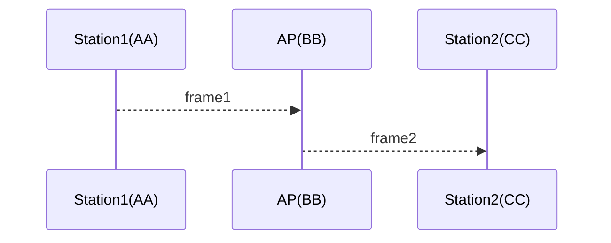

802.11 환경에서 AP나 Station이 신호를 보내게 되면, monitor mode adapter에서는 그 신호 세기를 알 수 있으며, 신호 세기 정보는 radiotap header에 존재한다(일반적인 WiFi Device는 AP의 신호 세기만을 알 수 있지만 monitor mode에서는 Station의 신호 세기까지 알 수 있다).

대부분의 802.11 frame은 header 부분에 addr1, addr2, addr3의 정보를 가지며(Aknowledgement frame과 같은 경우는 하나의 addr 정보만 존재) 이 3개의 addr 정보는 각각 sa(source), da(destination), ta(transmitter), ra(receiver) 정보를 나타낸다.

다음과 같이 Station1에서 Station2로 어떠한 ethernet frame을 보낸다고 하는 경우 sa, da, ta, ra 정보는 다음과 같다. sa와 da는 ethernet frame의 smac, dmac의 정보라고 생각하면 된다.



||sa|da|ta|ra|
|-|-|-|-|-|
|frame1|AA|CC|AA|BB|
|frame2|AA|CC|BB|CC|

## wireshark를 이용하여 특정 device의 signal strength 정보 알아내기

* Statistics -I/O Graphs 메뉴를 클릭하고 더하기 버튼(Add a new graph)을 눌러서 다음과 같은 graph를 추가한다.

|Graph Name|Display Filter|Y Axis|Y Field|
|-|-|-|-|
|any|wlan.ta == \<mac addr\>|AVG(Y Field)|wlan_radio.signal_dbm|

## tshark를 이용하여 특정 device의 signal strength 정보 알아내기

* 특정 디바이스의 전송 신호 세기를 알아보려면 다음과 같은 명령어를 이용하면 된다.

```
tshark -i <interface> -Y "wlan.ta == <mac addr>" -T fields -e frame.time -e wlan_radio.signal_dbm
```

## Youtube
https://youtu.be/u29DCu0Jgms