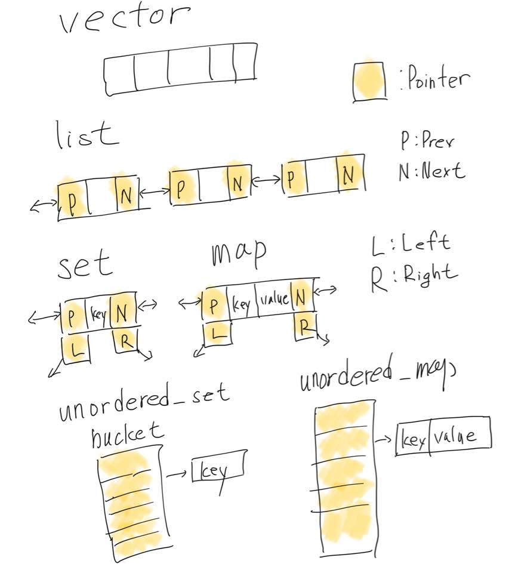

STL
===

C++에서는 다양한 data strucre를 STL로 지원한다.

## vector
* item을 메모리 상에서 일련적으로 열결되어 관리함.
* [https://en.cppreference.com/w/cpp/container/vector](https://en.cppreference.com/w/cpp/container/vector)

## list
* item을 (double) linked list로 관리함.
* [https://en.cppreference.com/w/cpp/container/list](https://en.cppreference.com/w/cpp/container/list)

## set
* 중복을 허용하지 않는 item(key)을 관리함. 내부적으로 binary search를 사용함.
* [https://en.cppreference.com/w/cpp/container/set](https://en.cppreference.com/w/cpp/container/set)

## map
* 중복을 허용하지 않는 key와 관련된 value를 관리함. 내부적으로 binary search를 사용.
* [https://en.cppreference.com/w/cpp/container/map](https://en.cppreference.com/w/cpp/container/map)

## unordered_set
* 중복을 허용하지 않는 item(key)을 관리함. 내부적으로 hash search를 사용함.
* [https://en.cppreference.com/w/cpp/container/unordered_set](https://en.cppreference.com/w/cpp/container/unordered_set)

## unordered_map
* 중복을 허용하지 않는 key와 관련된 value를 관리함. 내부적으로 hash search를 사용.
* [https://en.cppreference.com/w/cpp/container/unordered_map](https://en.cppreference.com/w/cpp/container/unordered_map)

## 그림 정리

